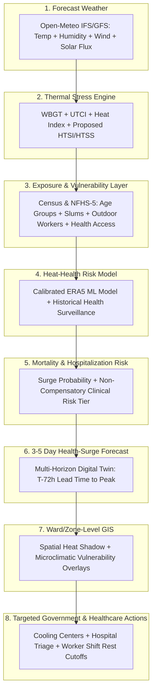
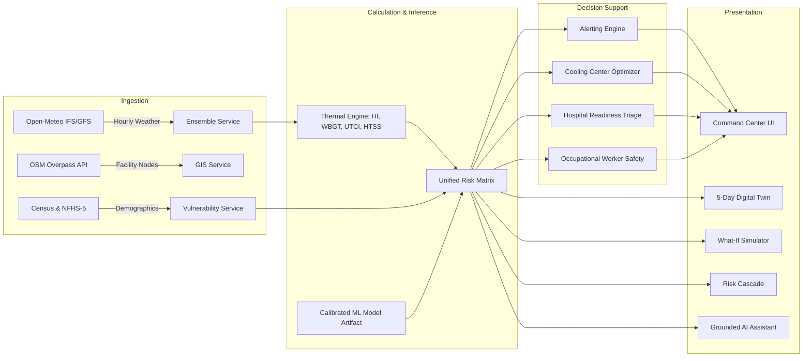

# SIH26083 — Platform Architecture & Technical Design

**Organization:** Ministry of Earth Sciences (MoES) / NCMRWF  
**Author:** Lead Software, ML & Product Architecture Team

---

## 1. Architectural Philosophy: Unified High-Performance Full-Stack

The platform adopts a unified TypeScript / Next.js full-stack architecture running natively on Node.js and modern web standards. By porting complex biometeorological algorithms and pre-serializing offline-trained Machine Learning weights into zero-overhead JSON matrices (`heat-risk-model.json`), the system achieves:
1. **Sub-Millisecond Inference**: Full multi-variable thermal calculations and 5-class risk predictions execute in `<1ms` without spawning external Python runtimes.
2. **Instantaneous Client-Side What-If Simulations**: Evaluators can drag microclimatic sliders and observe synchronous recalculations without network round-trip latency.
3. **100% Offline Demo Resilience**: In the event of a venue network outage, the platform falls back seamlessly to cached ERA5 baselines and local simulation without crashing.

---

## 2. Core Architecture & End-to-End Pipeline Dataflow

$$\mathbf{Forecast\ Weather \longrightarrow Thermal\ Stress\ Engine \longrightarrow Population\ Exposure\ \&\ Vulnerability \longrightarrow Heat\text{-}Health\ Risk\ Model \longrightarrow Mortality\ \&\ Hospitalization\ Risk \longrightarrow 3–5\ Day\ Health\text{-}Surge\ Forecast \longrightarrow Ward/Zone\text{-}Level\ GIS \longrightarrow Targeted\ Actions}$$

---

## 3. Modular Decomposition

### `lib/thermal-engine.ts`
- **Purpose**: Pure mathematical implementation of international biometeorological standards.
- **Formulas**:
  - NOAA Rothfusz polynomial regression for Heat Index ($T_{dry}$, $RH$).
  - Australian BoM outdoor simplified Wet Bulb Globe Temperature ($T_{dry}$, vapor pressure $e$, solar flux $sr$).
  - Bröde et al. (2012) UTCI regression ($T_{dry}$, $RH$, $v_{10m}$, $T_{mrt}$).
  - Stull (2011) psychrometric Wet Bulb equation.
  - Physiological Equivalent Temperature (PET) approximation.
  - 0–100 Human Thermal Stress Score (HTSS) with non-compensatory safeguard.

### `lib/vulnerability-engine.ts`
- **Purpose**: Quantifies socio-demographic and infrastructural vulnerability.
- **Parameters**: Elderly (>60), young children (<5), outdoor manual laborers, informal settlement / slum housing density, healthcare access index, and tree canopy buffer.
- **Dataset**: Built-in demographic profiles for 32 Indian states and high-resolution municipal ward profiles for major metros (Pune, Delhi NCR, Ahmedabad).

### `lib/simulation-engine.ts`
- **Purpose**: Core compute engine behind the interactive What-If scenario simulator.
- **Functionality**: Recomputes all thermal indices, demographic exposure, and alert classifications across arbitrary $\Delta T$, $\Delta RH$, $\Delta Wind$, $\Delta Solar$, and worker exposure adjustments in real time.

### `lib/cooling-optimizer.ts`
- **Purpose**: Algorithmic spatial allocation for temporary emergency cooling centers.
- **Algorithm**: Heuristic scoring evaluating unserved thermal risk shadow:
  $$Score = \left(\frac{HTSS}{100}\right) \times \left(\frac{Pop_{vuln}}{5,000}\right) \times DistanceToNearestCenterKm$$

### `lib/hospital-readiness.ts`
- **Purpose**: Decision-support surge triage for district healthcare authorities.
- **States**: `NORMAL`, `PREPARE`, `HIGH ALERT`, `CRITICAL`.
- **Outputs**: Heatstroke cooling bed availability, cold saline IV reserves, and ambulance dispatch directives.

### `lib/worker-safety.ts`
- **Purpose**: Occupational heat strain mitigation.
- **Profiles**: Construction, Street Vendors, Traffic Police, Delivery Executives, and Agricultural Laborers.
- **Outputs**: Work-rest cycles (e.g., 20m rest / 40m work), hourly hydration volumes, and hazardous window cutoffs.

### `lib/cascade-engine.ts`
- **Purpose**: Generates the 6-stage causal chain connecting meteorological forcing to response actions.

### `lib/digital-twin.ts`
- **Purpose**: Generates synchronized multi-horizon states (Current, +24h, +48h, +72h, Day 4, Day 5) and isolates early warning lead-time.

### `lib/history-memory.ts`
- **Purpose**: Maintains historical records of landmark Indian heatwaves (2010, 2015, 2022, 2024) and generates side-by-side comparative benchmarking.

### `lib/localization.ts`
- **Purpose**: Dynamic multi-language localization dictionary supporting English, Hindi, Marathi, and Kannada.

### `lib/assistant-engine.ts`
- **Purpose**: Grounded conversational AI assistant querying active application state, calculating on-the-fly What-If impacts, and generating public advisories.

### `lib/data-quality.ts`
- **Purpose**: Real-time system health monitoring, API ping telemetry, input completeness tracking, and confidence scoring.

---

## 4. Security & Role-Based Access Control (RBAC)

1. **Authentication**: Cryptographically signed HMAC-SHA256 HttpOnly session cookies.
2. **Access Gating**:
   - **Public Access**: Command Center, Interactive GIS, 5-Day Digital Twin, What-If Simulator, Risk Cascade, Cooling Centers, Hospital Readiness, Worker Safety, AI Assistant, and Telemetry Monitor.
   - **Officer Access**: Protected authority management, operational incident reporting, persistent alert dispatch, and audit log exports.
3. **Audit Trails**: All operational modifications (alert issuances, incident reports) are recorded with timestamps, user identities, and action hashes.
