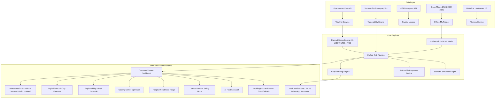

# SIH26083 — Implementation Roadmap: Extreme Heatwave Early Warning & Human Thermal Stress Intelligence

**Lead Architect:** Antigravity AI Engineering Team  
**Stakeholders:** Ministry of Earth Sciences (MoES) / NCMRWF  
**Target Milestone:** Production-grade, serious disaster-management command center prototype with 14 unique features, validated ML pipeline, and live 5–8 minute evaluation workflow.

---

## 1. Architectural Blueprint & Target Stack

### Technology Stack:
- **Framework:** Next.js 15+ / React 19 + TypeScript (Full-Stack Unified Architecture)
- **Styling & UI:** Tailwind CSS v4, Radix UI Primitives, Lucide Icons, Glassmorphic Command Center theme
- **Geospatial & GIS:** Leaflet + React-Leaflet (raster/geojson ward tiles) + `@svg-maps/india` (interactive choropleth vector map)
- **Visualization:** Recharts v3 (5-day trend, risk cascade, radar diagrams, confusion matrix, SHAP waterflow)
- **State & Simulation:** Central Reactive Scenario Store with real-time recalculation
- **Security & Roles:** HMAC-SHA256 HttpOnly signed session cookies, Officer/Admin RBAC, audit logging
- **Speech & AI:** Web Speech API voice synthesis/recognition + grounded retrieval assistant

---

## 2. Phased Development Roadmap

### Phase 0: Repository Audit & Planning [COMPLETED]
- [x] Cloned both candidate repositories (`THERMOS` and `thermowatch-sih26083`).
- [x] Analyzed architectures, dependencies, licenses, and scientific validity.
- [x] Tested dependencies and builds for both codebases.
- [x] Identified conflicts, reusable modules, and gaps against SIH26083.
- [x] Created `REPO_COMPARISON.md` and `IMPLEMENTATION_ROADMAP.md`.

---

### MVP (Minimum Viable Prototype)
**Goal:** Deliver the end-to-end meteorological-to-health risk pipeline.
1. **Multi-Variable Thermal Engine:**
   - Implement Rothfusz Heat Index with dry/humid boundary adjustments.
   - Implement Australian BoM outdoor simplified WBGT.
   - Implement Bröde et al. UTCI polynomial regression.
   - Implement 0–100 Human Thermal Stress Score (HTSS) with non-compensatory max-sub logic.
2. **Real Weather Integration:**
   - Integrate Open-Meteo live API with automatic offline demo cache fallback for 30+ major Indian cities.
3. **Reproducible ML Health Risk Inference:**
   - Calibrated 5-class risk classifier (`Low`, `Moderate`, `High`, `Extreme`, `Emergency`) running in zero-latency TypeScript.
   - Real-time confidence percentage, High+ probability, and SHAP-like feature contributions.
4. **Interactive GIS Map:**
   - National vector map with 30 city/district nodes colored by risk level, with live/forecast horizon toggles.
5. **Basic Command Center:**
   - Top operational alert banner, metrics summary, selected location panel, and actionable recommendations.

---

### Phase 1: Core Command Center & Hyperlocal GIS
**Goal:** High-fidelity government disaster-management UI and ward-level drill-down.
1. **Command Center Layout:**
   - Top: National alert status, overall risk gauge, peak temperature, national HTSS, and 72h escalation alert.
   - Center: Interactive GIS map with multi-layer controls:
     - Thermal Stress Layer (HI / WBGT / UTCI / HTSS)
     - Population Vulnerability Layer
     - Heatwave Alert Layer
     - Healthcare & Cooling Center Layer
   - Right: Comprehensive location risk drawer (Ward/District view).
   - Bottom: 5-Day forecast timeline, risk trend, and recommended authority protocols.
2. **Hyperlocal GIS (India → State → District → City → Ward):**
   - High-resolution ward boundary GeoJSON for key metro areas (e.g., Delhi NCR, Pune, Mumbai, Ahmedabad, Bengaluru).
   - Zone/Ward inspector displaying: HTSS, temperature, humidity, WBGT, UTCI, population density, outdoor worker concentration, and 72h trend.
3. **Data Integrity & Source Health:**
   - Explicit UI badges: `LIVE`, `ESTIMATED`, `DEMO / SYNTHETIC DATA`.
   - Data Source Health panel monitoring Weather API, GIS GeoJSON, Census Demographics, Health Records, and ML Model Status.

---

### Phase 2: Differentiating Intelligence Modules
**Goal:** Implement unique features 1 through 8 from the Master Brief.
1. **Feature 1 — Heat Risk Digital Twin:**
   - Side-by-side progression: Current $\to$ +24h $\to$ +48h $\to$ +72h $\to$ Day 4 $\to$ Day 5.
   - Synchronized tracking of Temperature, Humidity, WBGT, UTCI, HTSS, Vulnerability, and Predicted Health Risk.
2. **Feature 2 — What-If Heat Scenario Simulator:**
   - Sliders for Temperature (+1°C to +5°C), Relative Humidity ($\pm 20\%$), Wind Speed, Solar Radiation, Vulnerability Index, and Outdoor Exposure.
   - Real-time recalculation of Baseline vs. Scenario delta ($\Delta$ HTSS, $\Delta$ Health Risk, $\Delta$ Affected Population, Alert Level Shift).
3. **Feature 3 — Risk Explainability (SHAP-Equivalent):**
   - Visual attribution waterfall showing each environmental and demographic factor raising or lowering risk.
   - Natural-language explanation generated from structured contributions.
4. **Feature 4 — Heat Risk Cascade:**
   - Visual flowchart: Weather Conditions $\to$ Environmental Thermal Load $\to$ Population Exposure $\to$ Physiological Health Risk $\to$ Hospital Load Surge $\to$ Action Plan Trigger.
5. **Feature 5 — Heatwave Memory / Historical Comparison:**
   - Comparison engine benchmarking the active scenario against landmark Indian heatwaves (e.g., 2015 Andhra Pradesh/Telangana, 2022 North India, 2024 Delhi/Rajasthan record peak).
6. **Feature 6 — Smart Cooling Center Optimization:**
   - Facility locator querying OSM Overpass with fallback registry.
   - Spatial optimization scoring algorithm:
     $$Score_{candidate} = Risk_{zone} \times Population_{vulnerable} \times \text{Distance}(Candidate, \text{NearestExistingCenter})$$
   - Recommends the optimal location to deploy the next temporary misting/cooling shelter.
7. **Feature 7 — Hospital Readiness Level:**
   - Preparedness scoring: `NORMAL`, `PREPARE`, `HIGH ALERT`, `CRITICAL`.
   - Recommends emergency room hydration wards, ORS stock reserves, and cooling beds.
8. **Feature 8 — Outdoor Worker Safety Mode:**
   - Worker profile selector (Construction, Street Vendor, Traffic Police, Delivery Executive, Agricultural Worker).
   - Computes safe work windows, mandatory 15/30-min shade/hydration intervals, and peak danger cutoffs.

---

### Phase 3: Communication, Assistant & Authority Workflows
**Goal:** Implement unique features 9 through 14, multilingual localization, and role-based actions.
1. **Feature 9 — Multilingual Alerts:**
   - Real-time dynamic localization in **English**, **Hindi**, **Marathi**, and **Kannada**.
   - Pluggable translation dictionary supporting warning headlines, advisories, and SMS/WhatsApp templates.
2. **Feature 10 — Grounded AI Heat Assistant:**
   - Natural language query interface powered by structured situational state.
   - Capable of answering questions like:
     - *"Which wards in Pune are at extreme risk today?"*
     - *"What happens to Delhi if temperature rises by 2°C?"*
     - *"Generate a bilingual public advisory for outdoor workers in Ahmedabad."*
   - Includes browser Web Speech API voice synthesis and speech recognition.
3. **Feature 11 — Controlled Demo Scenario Engine:**
   - 6 instant demo presets:
     1. Normal Summer
     2. Severe Heatwave (Dry North)
     3. Coastal Humid Heatwave (High WBGT)
     4. Extreme Heat Crisis (Delhi/Rajasthan 47°C)
     5. Rapid Escalation Event (+3°C in 24h)
     6. Vulnerable Population Crisis (High slum/elderly density)
   - Switches all dashboard metrics, maps, charts, and alerts synchronously.
4. **Feature 12 — Early Warning Lead-Time:**
   - T-72h, T-48h, T-24h, T-12h, and Peak countdown with escalating preparedness checklists.
5. **Feature 13 & 14 — Data Quality, Confidence & Health:**
   - Exposes prediction confidence, weather data age, missing variable detection, and telemetry status.
6. **Authority Operations & Audit Trail:**
   - Officer login, alert broadcast simulation (Web Notification, SMS preview, WhatsApp preview), incident triage, and one-click PDF/CSV situation brief export.

---

### Phase 4: Testing, Verification & Polish
**Goal:** Complete automated testing, accessibility audit, browser verification, and documentation.
1. **Automated Unit & Integration Tests:**
   - Thermal calculation verification against published NOAA, BoM, and ISO tables.
   - ML model probability distribution and threshold unit tests.
   - Forecast time alignment and ensemble tests.
   - API smoke tests and route validation.
2. **Browser Verification & Mobile Responsiveness:**
   - Verify layout on Desktop (1920x1080), Tablet, and Mobile viewport.
   - Test Mobile/Field Officer mode for quick advisory triggers and offline PWA capability.
3. **Complete Documentation Suite:**
   - `README.md`
   - `ARCHITECTURE.md`
   - `REPO_COMPARISON.md`
   - `DATA_SOURCES.md`
   - `ML_METHODOLOGY.md`
   - `THERMAL_INDEX_METHODOLOGY.md`
   - `API_DOCUMENTATION.md`
   - `DEMO_GUIDE.md`
   - `LICENSES_AND_ATTRIBUTIONS.md`
   - `LIMITATIONS.md`

---

## 3. Data Requirements & Schemas

### Central Data Contract (`types/index.ts`):
- `WeatherData`: Temperature, Relative Humidity, Wind Speed, Solar Radiation, Pressure, Cloud Cover, Timestamp.
- `ThermalMetrics`: Heat Index, WBGT, UTCI, PET, HTSS, Primary Contributor, Category.
- `VulnerabilityData`: Elderly Ratio, Children Ratio, Outdoor Worker Density, Slum Density, Healthcare Access Score, Overall PVI.
- `HealthRiskPrediction`: Risk Score, Category (`Low` to `Emergency`), Confidence %, High+ Probability %, Horizon (`Current` to `5-Day`), Factor Attributions.
- `Alert`: ID, Location, Severity (`Normal`, `Watch`, `Warning`, `Extreme`), Start Time, Duration, Peak Forecast, Reasons, Recommended Actions.
- `CoolingCenter`: ID, Name, Coordinates, Capacity, Current Status, Distance to Target, Optimization Priority Score.
- `Hospital`: ID, Name, Coordinates, ICU Beds, Burn/Heat Stroke Beds, Readiness Level, Distance.

---

## 4. Live Demo Flow (5–8 Minute Hackathon Pitch)

1. **Step 1 — Command Center Opening:** Open dashboard, show live national status and top alert ticker.
2. **Step 2 — India Heat Risk Map:** Show 30+ monitored districts colored by real-time HTSS.
3. **Step 3 & 4 — City Selection & Hyperlocal Drilldown:** Click a high-risk metro (e.g., Pune / Delhi), zoom to Ward level, inspect Ward 12.
4. **Step 5 & 6 — Thermal Stress & Explainability:** Examine HTSS 86/100; expand the Explainability waterfall showing high temperature, humidity, and outdoor worker density.
5. **Step 7 & 8 — 5-Day Forecast & Health Risk:** Review the 5-day horizon showing escalation toward Day 3.
6. **Step 9 & 10 — Vulnerability Layer:** Toggle vulnerability overlay highlighting elderly and slum concentrations.
7. **Step 11, 12 & 13 — What-If Simulator:** Increase temperature by +2°C; observe instant escalation of HTSS, health risk, and affected citizen count.
8. **Step 14 & 15 — Early Warning & Actionable Guidance:** Review triggered Orange/Red warning and specific instructions for authorities, outdoor workers, and citizens.
9. **Step 16 — Smart Cooling Center Optimization:** View spatial scoring recommending the exact ward for the next temporary cooling facility.
10. **Step 17 & 18 — Grounded AI Assistant:** Ask: *"Which areas require immediate intervention and why?"* Show grounded, real-time response.
11. **Step 19 — Multilingual Advisory:** Switch advisory language to Marathi and Hindi.
12. **Step 20 — Simulated Notification & Officer Export:** Trigger simulated WhatsApp/SMS broadcast and export the authority situation brief.
